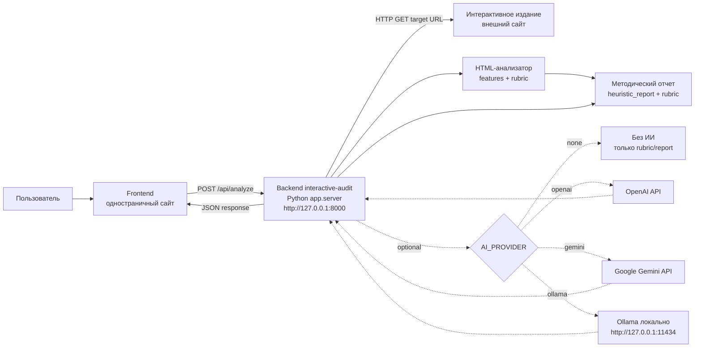
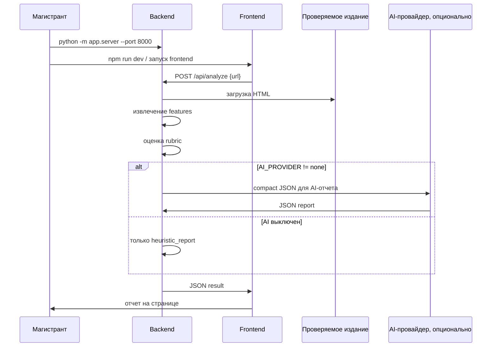

# Инструкция по развертыванию

Эта инструкция описывает локальный запуск backend-сервиса `interactive-audit` и его подключение к frontend. Базовый режим работает без API-ключей и без установки внешних Python-зависимостей.

## Что нужно установить

1. **Git**  
   Нужен для скачивания проекта с GitHub.

2. **Python 3.11 или выше**  
   Проверка:

   ```powershell
   python --version
   ```

3. **Опционально: Ollama**  
   Нужна только для локального ИИ-отчета без облачных API-ключей.

## Диаграмма развертывания



## Быстрый запуск без ИИ

Этот режим подходит для первой проверки и демонстрации методической части.

1. Скачайте проект:

   ```powershell
   git clone https://github.com/oleslav24/interactive-audit.git
   cd interactive-audit
   ```

2. Создайте локальный `.env`:

   ```powershell
   Copy-Item .env.example .env
   ```

3. Убедитесь, что в `.env` стоит:

   ```env
   AI_PROVIDER=none
   AI_ENABLED=true
   ```

4. Запустите backend:

   ```powershell
   python -m app.server --host 127.0.0.1 --port 8000
   ```

5. Откройте проверочный URL:

   ```text
   http://127.0.0.1:8000/health
   ```

   Ожидаемый ответ:

   ```json
   {
     "status": "ok",
     "ai_enabled": true,
     "ai_provider": "none",
     "ai_model": null,
     "openai_model": "gpt-5.4-mini",
     "runtime": "stdlib-http"
   }
   ```

## Проверка анализа

PowerShell-запрос:

```powershell
Invoke-RestMethod `
  -Uri http://127.0.0.1:8000/api/analyze `
  -Method POST `
  -ContentType 'application/json' `
  -Body '{"url":"https://example.com","use_ai":false,"include_features":true}'
```

Если запрос успешный, backend вернет:

- `page` — информация о загруженной странице;
- `features` — извлеченные HTML-признаки;
- `rubric` — оценки по критериям;
- `heuristic_report` — основной методический отчет;
- `ai` — состояние ИИ-модуля.

При `AI_PROVIDER=none` это нормально:

```json
{
  "ai": {
    "used": false,
    "provider": "none",
    "model": null,
    "report": null,
    "error": "AI provider is disabled."
  }
}
```

Frontend должен показывать `heuristic_report` и `rubric`, даже если `ai.used=false`.

## Подключение frontend

Backend URL для локальной разработки:

```text
http://127.0.0.1:8000
```

Основной endpoint:

```text
POST /api/analyze
```

Минимальный запрос из frontend:

```ts
const response = await fetch("http://127.0.0.1:8000/api/analyze", {
  method: "POST",
  headers: { "Content-Type": "application/json" },
  body: JSON.stringify({
    url: publicationUrl,
    use_ai: false,
    include_features: true,
  }),
});

const data = await response.json();

if (!response.ok) {
  throw new Error(data.error ?? "Analysis failed");
}
```

Рекомендуемый порядок отображения результата:

1. `heuristic_report.summary`
2. `rubric.overall_score`
3. `rubric.criteria`
4. `heuristic_report.advantages`
5. `heuristic_report.problems`
6. `heuristic_report.recommendations`
7. `ai.report`, только если `ai.used === true`

Подробный API-контракт: [API.md](API.md).

## Варианты ИИ-модуля

### 1. Без ИИ

Самый надежный режим для базовой демонстрации.

```env
AI_PROVIDER=none
```

### 2. Google Gemini

Подходит как облачный вариант с потенциально доступным free tier.

```env
AI_PROVIDER=gemini
GEMINI_API_KEY=ваш_ключ
GEMINI_MODEL=gemini-2.5-flash
```

После изменения `.env` перезапустите backend.

### 3. Ollama локально

Подходит для демонстрации без внешнего API-ключа.

1. Установите Ollama.

2. Скачайте модель:

   ```powershell
   ollama pull qwen2.5:7b
   ```

3. В `.env`:

   ```env
   AI_PROVIDER=ollama
   OLLAMA_BASE_URL=http://127.0.0.1:11434
   OLLAMA_MODEL=qwen2.5:7b
   ```

4. Перезапустите backend.

### 4. OpenAI

Используется как дополнительный платный/премиальный провайдер.

```env
AI_PROVIDER=openai
OPENAI_API_KEY=ваш_ключ
OPENAI_MODEL=gpt-5.4-mini
```

## Типовая локальная схема запуска



## Частые проблемы

| Проблема | Причина | Что сделать |
| --- | --- | --- |
| `/health` не открывается | Backend не запущен или занят другой порт | Запустить `python -m app.server --port 8000` или выбрать другой порт |
| `Address already in use` | На порту 8000 уже есть процесс | Остановить старый процесс или запустить на `--port 8001` |
| `502` при `/api/analyze` | Backend не смог скачать проверяемый URL | Проверить интернет, URL, доступность сайта |
| `400` при `/api/analyze` | Неверный URL или заблокирован localhost/private IP | Использовать публичный URL или временно поставить `ALLOW_PRIVATE_URLS=true` для локальной демонстрации |
| `ai.used=false` | ИИ отключен, не выбран провайдер или нет ключа | Это не ошибка анализа; смотрите `heuristic_report` и `rubric` |
| Frontend не видит backend | Неверный base URL или backend не запущен | Проверить `http://127.0.0.1:8000/health` |

## Что передать в отчете о развертывании

Можно описать систему так:

> Прототип развертывается как локальный backend-сервис на Python, предоставляющий JSON API для frontend. Backend выполняет загрузку HTML проверяемого интерактивного издания, извлекает структурные и мультимедийные признаки, оценивает их по методической рубрике и формирует отчет. ИИ-модуль является опциональным и может быть отключен либо подключен через сменного провайдера: Google Gemini, OpenAI или локальный Ollama.
